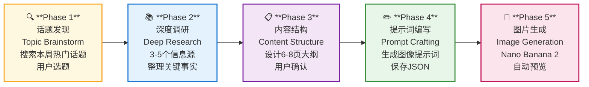
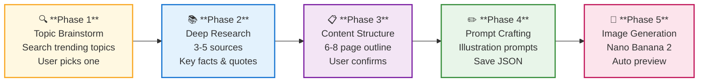

# sketch-post

<div align="center">

[中文](#中文) · [English](#english)

</div>

---

## 中文

sketch-post 是一个五阶段 AI 工作流，用于创作手绘风格中文插画社交媒体图文，由 **Nano Banana 2**（Gemini 3.1 Flash Image / `gemini-3.1-flash-image-preview`）驱动。每篇图文 6–8 页，3:4 竖版，适合发布于任何社交媒体平台。

### 工作原理

当你让 AI 助手创作图文时，sketch-post 不会直接开始生成图片。它会先搜索本周真正热门的话题，询问你想探索哪个方向。确认方向后，深入调研多个信息源，逐页拼出内容结构，在写第一个提示词之前先展示给你看。只有在你确认结构之后，才会为每一页生成详细插画提示词，然后启动图片生成器。整个流程围绕确认节点构建——每一步都等待你的确认，没有你的指令，流程不会推进。

### 工作流程



> 每个阶段完成后等待用户确认，未经确认流程不会推进。

### 安装

> 各平台安装方式不同。Claude Code 和 Cursor 有内置插件市场，Gemini CLI 使用扩展系统，OpenClaw 使用 ClawHub，Codex 和 OpenCode 需手动获取。

#### Claude Code（官方市场）

```bash
/plugin install sketch-post@hoopyAI
```

#### Claude Code（GitHub）

```bash
/plugin install github:hoopyAI/sketch-post
```

#### Cursor

在 Cursor Agent 对话框中：

```text
/add-plugin sketch-post
```

或在 Cursor 插件市场搜索 "sketch-post"。

#### Gemini CLI

```bash
gemini extensions install https://github.com/hoopyAI/sketch-post
```

更新：

```bash
gemini extensions update sketch-post
```

#### OpenClaw

```bash
clawhub install hoopyAI/sketch-post
```

更新：

```bash
clawhub update sketch-post
```

#### Codex

告诉 Codex：

```
Fetch and follow instructions from https://raw.githubusercontent.com/hoopyAI/sketch-post/main/README.md
```

#### OpenCode

告诉 OpenCode：

```
Fetch and follow instructions from https://raw.githubusercontent.com/hoopyAI/sketch-post/main/README.md
```

#### 验证安装

新开一个会话，说：「帮我做一个关于气候变化的图文」——AI 助手会自动识别技能并启动第一阶段。

### 前置条件

本插件使用 **Google AI（Gemini）API** 进行图片生成。

#### 获取并配置 API Key

**第一步：获取 Key**

1. 访问 [Google AI Studio](https://aistudio.google.com/app/apikey)
2. 用 Google 账号登录（免费）
3. 点击 **Create API key** → 选择或新建一个 Google Cloud 项目
4. 复制生成的 Key（格式为 `AIza` 开头）

**第二步：写入 `.env` 文件**

在你运行 sketch-post 命令的工作目录下创建 `.env` 文件（如果没有的话），写入：

```
GOOGLE_AI_API_KEY=AIzaxxxxxxxxxxxxxxxxxxxxxxxxxxxxxxxxxxxxxxx
```

> `.env` 文件已在 `.gitignore` 中排除，不会被提交到代码仓库。

#### 使用模型

| 模型 | API 名称 | 说明 |
|---|---|---|
| Nano Banana 2 | `gemini-3.1-flash-image-preview` | 默认 — 速度快，质量高 |

免费版有速率限制，脚本会自动重试（最多 5 次，指数退避）。如需更高并发，可在 [Google AI Studio](https://aistudio.google.com/app/apikey) 升级付费套餐。

### 五阶段工作流详情

1. **话题发现**（Topic Brainstorm）— 搜索本周热门话题，提供 5–8 个候选话题（含受众分析），等待用户选题
2. **深度调研**（Deep Research）— 调研 3–5 个信息源，整理关键事实、专家观点、真实影响，用中文输出调研摘要，等待确认角度
3. **内容结构**（Content Structure）— 提出 6–8 页内容大纲，每页有实质内容，等待用户确认
4. **提示词编写**（Prompt Crafting）— 为每页生成达芬奇手绘风水彩插画提示词，保存为 JSON，等待用户定稿
5. **图片生成**（Image Generation）— 调用 Nano Banana 2 批量生图，自动打开浏览器预览，询问是否需要重新生成

### 内容说明

| 技能 | 触发方式 | 用途 |
|---|---|---|
| `sketch-post` | `/sketch-post` 或描述图文创作需求 | 完整五阶段插画图文工作流 |

### 更新

```bash
/plugin update sketch-post
```

### 许可证

MIT License — 详见 [LICENSE](LICENSE) 文件。

### 支持

- **Issues**: https://github.com/hoopyAI/sketch-post/issues

---

## English

sketch-post is a 5-phase AI workflow for creating hand-drawn Chinese illustration posts for social media, powered by **Nano Banana 2** (Gemini 3.1 Flash Image / `gemini-3.1-flash-image-preview`). Each post is 6–8 pages in 3:4 portrait format, suitable for any social media platform.

### How it works

The moment you ask your agent to create a post, sketch-post doesn't just start generating images. Instead, it steps back and searches for what's actually trending — then asks you which topic you want to explore. Once you've picked a direction, it digs into real sources, assembles a page-by-page content outline, and shows it to you before writing a single prompt. Only after you've signed off on the structure does it craft detailed illustration prompts for each page and fire up the image generator. The whole process is built around confirmation gates — you stay in control at every step, and nothing moves forward without your say.

### Workflow



> Each phase waits for your confirmation before proceeding. Nothing moves forward without your say.

### Installation

**Note:** Installation differs by platform. Claude Code and Cursor have built-in plugin marketplaces. Gemini CLI uses the extensions system. OpenClaw uses ClawHub. Codex and OpenCode require a manual fetch step.

#### Claude Code (Official Marketplace)

```bash
/plugin install sketch-post@hoopyAI
```

#### Claude Code (GitHub)

```bash
/plugin install github:hoopyAI/sketch-post
```

#### Cursor

In Cursor Agent chat:

```text
/add-plugin sketch-post
```

Or search for "sketch-post" in the Cursor plugin marketplace.

#### Gemini CLI

```bash
gemini extensions install https://github.com/hoopyAI/sketch-post
```

To update:

```bash
gemini extensions update sketch-post
```

#### OpenClaw

```bash
clawhub install hoopyAI/sketch-post
```

To update:

```bash
clawhub update sketch-post
```

#### Codex

Tell Codex:

```
Fetch and follow instructions from https://raw.githubusercontent.com/hoopyAI/sketch-post/main/README.md
```

#### OpenCode

Tell OpenCode:

```
Fetch and follow instructions from https://raw.githubusercontent.com/hoopyAI/sketch-post/main/README.md
```

#### Verify Installation

Start a new session and say: "Create a sketch-post about climate change" — your agent should automatically pick up the skill and begin Phase 1.

### Prerequisites

This plugin uses the **Google AI (Gemini) API** for image generation.

#### Get and configure your API key

**Step 1: Get the key**

1. Go to [Google AI Studio](https://aistudio.google.com/app/apikey)
2. Sign in with a Google account (free)
3. Click **Create API key** → select or create a Google Cloud project
4. Copy the generated key — it starts with `AIza`

**Step 2: Add it to a `.env` file**

Create a `.env` file in the directory where you run sketch-post (if one doesn't exist already):

```
GOOGLE_AI_API_KEY=AIzaxxxxxxxxxxxxxxxxxxxxxxxxxxxxxxxxxxxxxxx
```

> The `.env` file is listed in `.gitignore` and will not be committed to your repository.

#### Model

| Model | API name | Notes |
|---|---|---|
| Nano Banana 2 | `gemini-3.1-flash-image-preview` | Default — fast, high quality |

The free tier allows limited requests per minute. If you hit rate limits, the script retries automatically with exponential backoff (5 attempts). For higher throughput, upgrade to a paid plan in [Google AI Studio](https://aistudio.google.com/app/apikey).

### The 5-Phase Workflow

1. **Topic Brainstorm** — searches for what's trending in your domain this week, presents 5-8 candidates with audience appeal, waits for your pick
2. **Deep Research** — researches 3-5 sources, collects key facts, expert quotes, real-world impact, writes a summary, waits for your angle confirmation
3. **Content Structure** — proposes a 6-8 page outline where every page is substantive content, waits for your approval
4. **Prompt Crafting** — writes a detailed illustration prompt for each page in Da Vinci sketch + watercolor style, saves to JSON, waits for your sign-off
5. **Image Generation** — runs Nano Banana 2 to generate all pages, auto-opens a browser preview, asks if any pages need regenerating

**Each phase waits for confirmation before proceeding.** Nothing moves forward without your say.

### What's Inside

| Skill | Trigger | Purpose |
|---|---|---|
| `sketch-post` | `/sketch-post` or describe a post creation task | Full 5-phase illustration post workflow |

### Updating

```bash
/plugin update sketch-post
```

### License

MIT License — see [LICENSE](LICENSE) file for details.

### Support

- **Issues**: https://github.com/hoopyAI/sketch-post/issues
